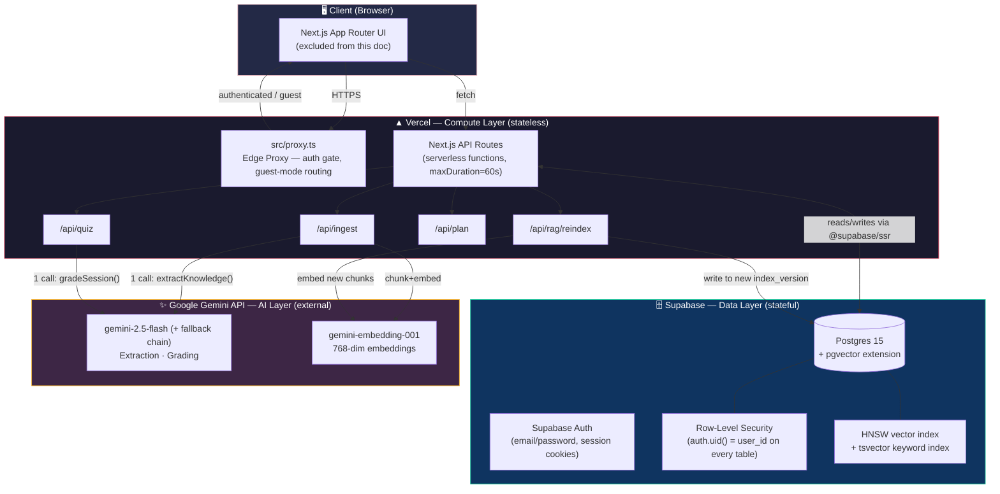
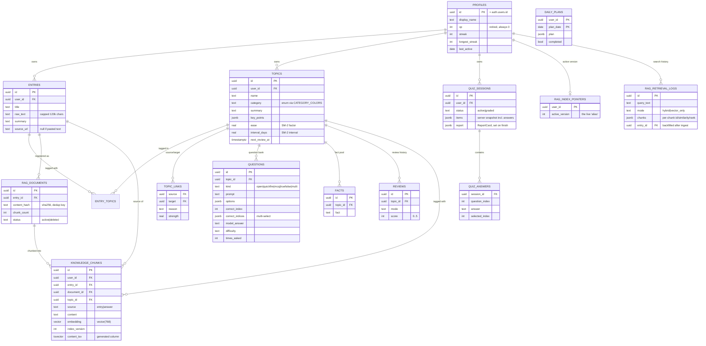
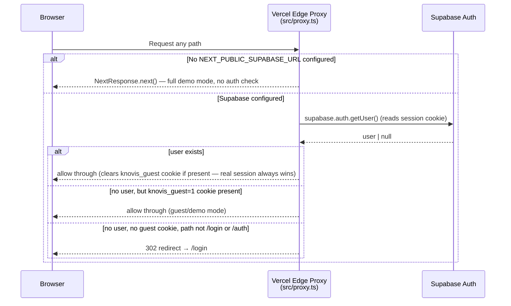
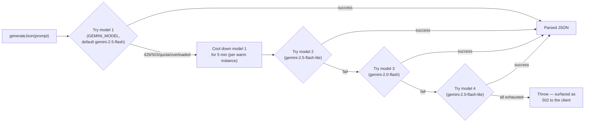
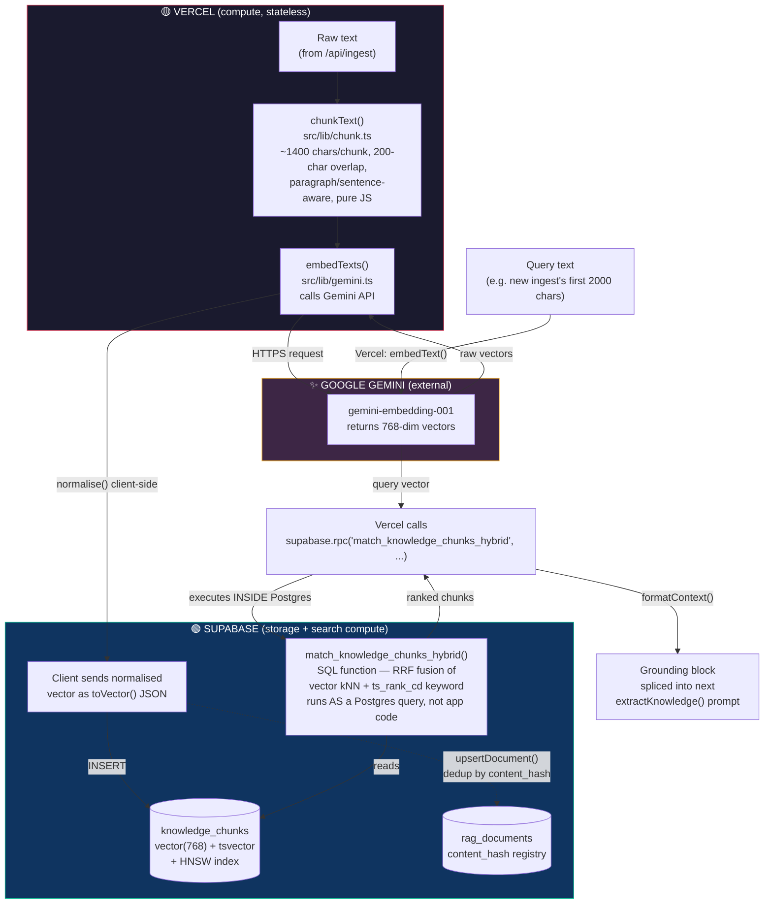
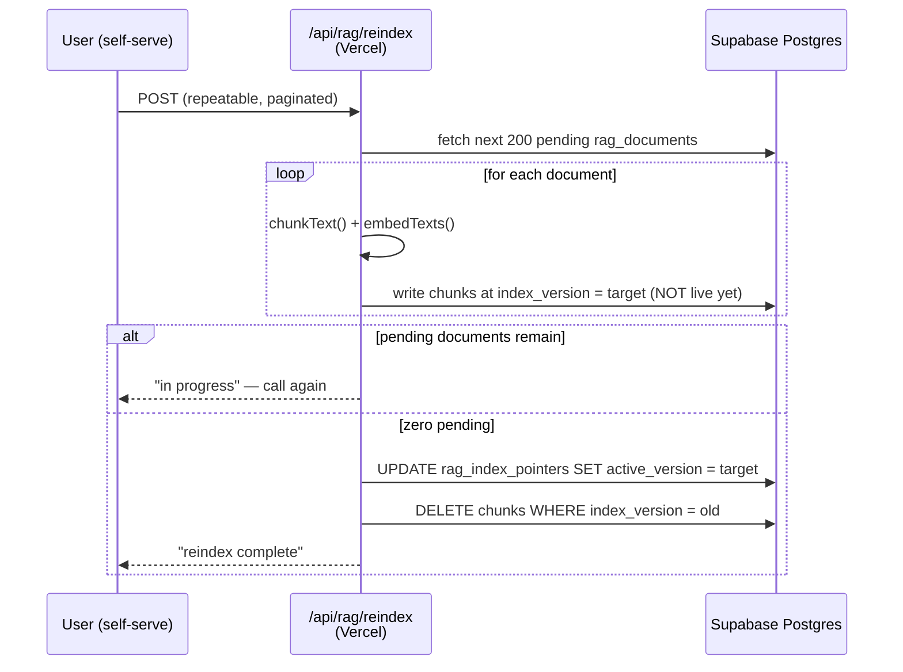
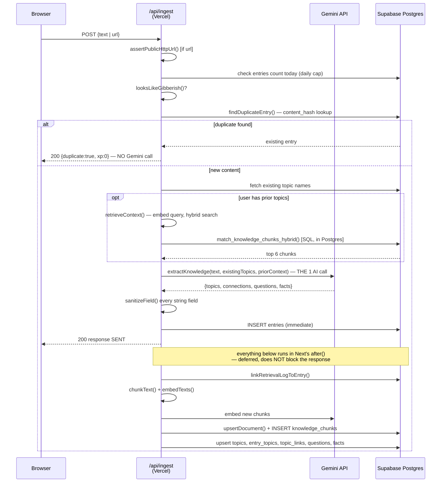
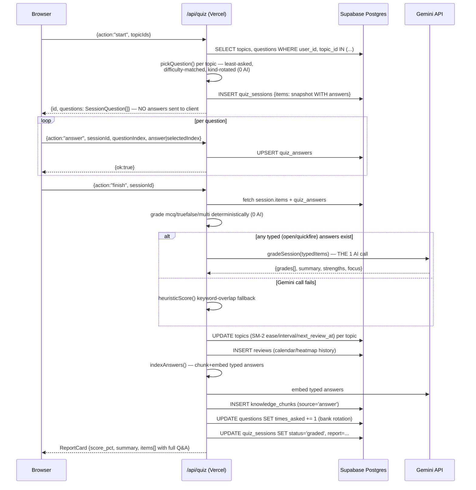

# 🧠 Knovis — System Architecture (HLD + LLD)

> **Scope:** Backend, AI/LLM layer, RAG (retrieval-augmented generation), Auth, and Security.
> Frontend/UI is intentionally excluded — this doc is for engineers who need to understand how data moves, where it's stored, and where compute happens.
>
> **Audience:** Engineering team. **Format:** print-friendly Markdown (renders best with Mermaid support — GitHub, Notion, Obsidian, VS Code, Typora).

---

## 📌 TL;DR — Where does the vector DB / vector search actually run?

This is the question that trips people up, so it goes first:

| Concern | Where it runs | Technology |
|---|---|---|
| **Vector storage** | 🟢 **Supabase** (Postgres) | `pgvector` extension, table `knowledge_chunks`, `vector(768)` column |
| **Vector index** | 🟢 **Supabase** (Postgres) | HNSW index (`vector_cosine_ops`) — built and maintained by Postgres itself |
| **Vector similarity search (kNN)** | 🟢 **Supabase** (Postgres, as SQL) | `match_knowledge_chunks()` — a Postgres function (RPC), executed **inside the database** |
| **Hybrid search (vector + keyword fusion)** | 🟢 **Supabase** (Postgres, as SQL) | `match_knowledge_chunks_hybrid()` — Reciprocal Rank Fusion of vector kNN + `tsvector`/`ts_rank_cd`, **entirely server-side SQL** |
| **Embedding generation (text → vector)** | 🟡 **Vercel** (serverless function) → calls out to **Google Gemini API** | `gemini-embedding-001`, called from `src/lib/gemini.ts` on Vercel; Vercel does **not** store or search vectors, it only requests them |
| **Chunking (text splitting)** | 🟡 **Vercel** (serverless function, pure JS, no external call) | `src/lib/chunk.ts` — runs in the same request as embedding |
| **LLM generation (extraction, grading)** | 🟡 **Vercel** (serverless function) → calls out to **Google Gemini API** | `gemini-2.5-flash` (+ fallback chain) |
| **Auth / session / RLS enforcement** | 🟢 **Supabase** | Postgres Row-Level Security, `auth.users`, Supabase Auth |
| **Edge routing / redirects** | 🟡 **Vercel** | `src/proxy.ts` (Next.js proxy, runs at the edge before any page/API loads) |

> **In one sentence:** Vercel is the *stateless orchestrator* — it fetches text, calls Gemini to turn it into vectors, and ships those vectors to Supabase. Supabase is the *stateful brain* — it stores the vectors, runs the actual nearest-neighbor and hybrid search math inside Postgres via SQL functions, and enforces per-user isolation via RLS. **No vector math ever runs inside Vercel's serverless functions** — they are dumb pipes between Gemini and Postgres.

---

## 1. 🏗️ High-Level Design (HLD)

### 1.1 System context diagram



### 1.2 The three planes

| Plane | Owner | Responsibility | Persistence? |
|---|---|---|---|
| 🟡 **Compute plane** | Vercel | Next.js 16 App Router, serverless API routes, edge proxy (auth gating), all orchestration logic | **None** — every function is stateless, cold-starts fresh |
| 🟢 **Data plane** | Supabase | Postgres (relational + vector), Auth, Row-Level Security, all SQL-side search functions | **Full source of truth** |
| ✨ **Intelligence plane** | Google Gemini | Text generation (extraction, grading) + embeddings | **None** — pure request/response, no state kept by Google for this app |

### 1.3 Deployment topology

- **Vercel**: hosts the Next.js 16.2.10 app (App Router + Turbopack). Deployed via Vercel CLI / GitHub integration (`vercel.json` sets `"framework": "nextjs"`). API routes run as **serverless functions** with `maxDuration = 60` seconds (needed because link-ingest does: fetch external page → Gemini extraction → multiple DB writes, all within one request). `src/proxy.ts` runs at the **edge** in front of nearly every route (matcher excludes static assets).
- **Supabase**: free-tier Postgres project. Hosts **everything stateful** — relational tables, the `pgvector` extension, Supabase Auth (email-only, Google OAuth was removed), and all Row-Level Security policies. The browser also talks to Supabase **directly** for reads (via `@supabase/supabase-js` client-side) — RLS is therefore the *only* thing standing between one user's data and another's.
- **Google Gemini**: called only from server-side code (`src/lib/gemini.ts`), never from the browser. API key (`GEMINI_API_KEY`) lives in Vercel environment variables only.

> ⚠️ **Decision on record (2026-07-15):** the team evaluated migrating from Supabase to TiDB (5GB free vs 500MB) and **rejected it** — TiDB has no built-in auth and no Postgres-style RLS, both of which are load-bearing here since the browser queries the DB directly. Path forward when 500MB is hit: upgrade to Supabase Pro ($25/mo, 8GB, no 7-day inactivity pause) rather than migrate.

---

## 2. 🗃️ Data Model (LLD)

All tables live in Supabase Postgres, schema `public`, defined across `supabase/schema.sql` → `schema-rag.sql` → `schema-rag-v2.sql` (applied in that order; each is additive and safe to re-run).

### 2.1 Entity-relationship diagram



### 2.2 Table reference

| Table | Purpose | Written by | Read by |
|---|---|---|---|
| `profiles` | 1 row/user, auto-created by `handle_new_user()` trigger on signup | Trigger, `/profile` | Nav, dashboard |
| `entries` | Raw ingested text (pasted notes or fetched article) — the *source of truth* | `/api/ingest` | RAG indexing, blogs |
| `topics` | Nodes of the knowledge graph; SM-2 spaced-repetition state lives here | `/api/ingest`, `/api/quiz finish` | Everywhere |
| `topic_links` | Edges between topics, deduped by `(user_id, source, target)` with normalized direction | `/api/ingest` | Brain graph |
| `entry_topics` | Many-to-many join, entry ↔ topic | `/api/ingest` | Blog source attribution |
| `questions` | **Pre-generated question bank** — 7-8 Qs/topic, all 5 kinds, created at ingest time so quiz sessions cost zero AI calls | `/api/ingest` (from `extractKnowledge()`) | `/api/quiz start` |
| `facts` | Pool for the zero-AI "fact of the day" | `/api/ingest` | Dashboard |
| `quiz_sessions` | One row per review session; `items` is a **server-only snapshot including correct answers** — client only ever sees `SessionQuestion` (no answers) | `/api/quiz start/finish` | `/api/quiz answer/finish`, calendar |
| `quiz_answers` | One row per submitted/skipped answer, upserted on `(session_id, question_index)` | `/api/quiz answer` | `/api/quiz finish` |
| `reviews` | Append-only review history — drives the heatmap/calendar | `/api/quiz finish` | Calendar, streak |
| `daily_plans` | Cached daily revision plan (zero-AI narrative) | `/api/plan` | Dashboard |
| `knowledge_chunks` | **The vector store.** One row per chunk, `vector(768)` embedding + generated `tsvector` for keyword search | `indexContent()`/`indexAnswers()`/`reindexDocument()` in `rag.ts` | `match_knowledge_chunks()` / `match_knowledge_chunks_hybrid()` SQL functions |
| `rag_documents` | Registry: one row per indexed entry/answer, `content_hash` (sha256) for dedup | `upsertDocument()` in `rag.ts` | `findDuplicateEntry()` |
| `rag_index_pointers` | Per-user "alias" — which `index_version` is currently live | `setActiveIndexVersion()` | `retrieveContext()`, both match functions |
| `rag_retrieval_logs` | Chunk-level attribution per retrieval call — observability only, no product UI | `logRetrieval()` in `rag.ts` | `getRetrievalMetrics()`, `rag_index_version_correlation()` |
| `flashcards` | **Legacy/dead** — fully removed from the app (2026-07-14), table may still exist in old DBs | — | — |

### 2.3 Row-Level Security (RLS)

Every table has RLS enabled with an identical pattern:

```sql
create policy "own <table>" on public.<table>
  for all using (auth.uid() = user_id) with check (auth.uid() = user_id);
```

> 🔒 **Why this matters:** `src/lib/data.ts` queries Supabase **directly from the browser** for reads (not proxied through an API route). RLS is therefore the *entire* isolation boundary between users — there is no application-layer check backing it up. Any new table **must** get an RLS policy before it ships, or every user can read every other user's rows.

---

## 3. 🔐 Auth & Session Management (LLD)

### 3.1 Auth flow



### 3.2 Key mechanics (`src/proxy.ts`)

- Built on `@supabase/ssr`'s `createServerClient`, reading/writing the session via cookies (edge-compatible, no Node APIs).
- `PUBLIC_PATHS = ["/login", "/auth"]` — the only paths reachable without a session or guest cookie.
- **Guest/demo mode**: the `knovis_guest=1` cookie is the entire mechanism. Set by "Continue as guest" on `/login`; cleared automatically the instant a real session exists (a signed-in user always wins over guest state).
- **`isDemo` on the client** (`src/lib/demo.ts`) = `!NEXT_PUBLIC_SUPABASE_URL || knovis_guest cookie present`. In demo mode, `data.ts` short-circuits every read/write to serve seeded fixture data from `demo.ts` and persists mutations to `localStorage` (`knovis.demo.v1`) instead of touching Supabase at all — **no network calls to Supabase or Gemini happen in guest mode.**
- Signup: `raw_user_meta_data.name` (captured at signup) → `handle_new_user()` Postgres trigger → `profiles.display_name`. No email verification gate is enforced beyond Supabase's own defaults.
- OAuth: Google OAuth was **removed** — email/password is the only real-auth method.

### 3.3 Auth in API routes vs. direct browser reads

| Path | Auth mechanism |
|---|---|
| Server-side API routes (`/api/ingest`, `/api/quiz`, `/api/plan`, `/api/rag/reindex`) | `createClient()` (`src/lib/supabase/server.ts`) reads the session cookie server-side, then explicitly checks `const { data: { user } } = await supabase.auth.getUser(); if (!user) return 401` |
| Browser-direct reads (`src/lib/data.ts`, most dashboard/brain data) | No app-layer check at all — the Supabase client is initialized with the **anon key**, and **RLS is the only gate** |

---

## 4. 🛡️ Security Posture

> Reviewed and hardened across sessions on 2026-07-15 and 2026-07-16. Summary below; see `SESSION_LOG.md` for full history.

### 4.1 Threat → mitigation map

| # | Threat | Mitigation | Where |
|---|---|---|---|
| 1 | **SSRF via link ingestion** — a user pastes a link to `http://169.254.169.254/...` (cloud metadata) or an internal service | `assertPublicHttpUrl()` blocks loopback/private/link-local/CGNAT IPv4, IPv6 ULA/link-local, `localhost`/`.local`/`.internal` hostnames, credentials-in-URL, and non-standard ports. Applied to the **initial URL AND every redirect hop** (redirects followed manually, max 5 hops, one shared 20s deadline across the whole chain — not 15s × 5 hops) | `src/app/api/ingest/route.ts` |
| 2 | **Gemini quota exhaustion / cost abuse** | Per-user daily ingest cap (`INGEST_DAILY_LIMIT`, default 20) — checked against `entries` count since local midnight, before the Gemini call | `src/app/api/ingest/route.ts` |
| 3 | **Storage abuse via giant pastes** | Ingested text capped at 120,000 chars before storage; fetched article text capped at 30,000 chars before it reaches the Gemini prompt | `src/app/api/ingest/route.ts` |
| 4 | **Spam / gibberish polluting the knowledge base** (and burning a Gemini call for junk) | `looksLikeGibberish()` — dependency-free heuristics: repeated-pattern-run regex, meaningful-char ratio, distinct-char ratio, distinct-word ratio. Deliberately lenient (dense tech text, code, LaTeX, non-English prose all pass) | `src/lib/guardrails.ts`, wired into `/api/ingest` **before** the Gemini call |
| 5 | **Prompt injection via ingested/fetched text** — link ingestion feeds arbitrary third-party webpage text straight into the Gemini prompt | Explicit "untrusted data, not instructions" framing in the extraction prompt, with a rule to never follow embedded commands. **Blast radius even if bypassed:** no `dangerouslySetInnerHTML` anywhere in the app (verified by grep) — AI output can only render as inert text via React's default escaping | `src/lib/gemini.ts` `extractKnowledge()` prompt |
| 6 | **A manipulated/hallucinating model returning oversized or malformed fields** | `sanitizeField()` strips control characters and clamps length on **every** field Gemini returns (title, summary, topic name/summary/key_points, connection reason, question prompt/model_answer/options, fact text) before it touches the DB. Topic `category` validated against the `CATEGORY_COLORS` allowlist with a `"General"` fallback | `src/lib/guardrails.ts`, applied in `/api/ingest` after extraction |
| 7 | **XSS via `javascript:`/`data:` URI links** | `isSafeHref()` in the Markdown renderer only renders `[text](url)` as a clickable `<a>` for `http`/`https`/`mailto` (or relative) schemes — anything else renders as inert plain text. (Reachable via the personal-notes feature, not AI content — verified live with `javascript:alert(...)` and `data:text/html,<script>...` payloads) | `src/components/Markdown.tsx` |
| 8 | **Malformed request bodies crashing a route** | Every API route wraps `request.json()` in try/catch → 400 on parse failure | All `/api/*` routes |
| 9 | **Auth callback failure silently landing on the dashboard** | `/auth/callback` redirects to `/login?error=auth` when `exchangeCodeForSession` fails, instead of a silent fallthrough | `src/app/auth/callback/route.ts` |
| 10 | **Cross-user data access** | RLS (`auth.uid() = user_id`) on **every** table without exception, including RAG tables | Postgres, all schema files |
| 11 | **Secrets in the repo** | `.env.local` is gitignored; `GEMINI_API_KEY` lives only in Vercel env vars, never sent to the browser | Deployment config |

### 4.2 Security review checklist (for new features)

- [ ] New table? → RLS policy `auth.uid() = user_id` (or ownership-via-join for junction tables)
- [ ] New AI-generated field rendered to users? → run through `sanitizeField()`, never `dangerouslySetInnerHTML`
- [ ] New external fetch (URL from user input)? → route it through `assertPublicHttpUrl()`
- [ ] New AI call? → check it doesn't break the "1 call per ingest / 1 per quiz finish" budget (§5.1) without a deliberate decision
- [ ] New markdown/HTML render path? → check link scheme allowlist applies

---

## 5. ✨ AI / LLM Layer (LLD)

### 5.1 AI-call budget — a deliberate design constraint

> **Rule:** exactly **1 Gemini call per ingest** and **1 Gemini call per finished quiz session**. Every other feature (daily plan, fact of the day, quiz start/answer, blog rendering) is **zero-AI**. This is a cost/latency constraint the team holds deliberately — new features should not silently add AI calls.

| Feature | AI calls | Why |
|---|---|---|
| Ingest (paste/link) | **1** — `extractKnowledge()` | Generates topics + connections + a 7-8 question bank/topic (all 5 kinds) + facts, all **up front**, so review sessions never need to call AI again |
| Quiz `start` | **0** | Picks pre-generated questions from the bank (least-asked, difficulty-matched, kind-rotated) |
| Quiz `answer` | **0** | Pure DB write |
| Quiz `finish` | **1** (skipped if nothing typed) — `gradeSession()` | Batch-grades every typed (open/quickfire) answer in ONE call; choice kinds (mcq/truefalse/multi) graded deterministically in code |
| Daily plan | **0** | `composeNarrative()` — day-rotating headline templates + reused `topic_links.reason` |
| Fact of the day | **0** | Deterministic day-hash pick from the pre-generated `facts` pool |
| RAG retrieval (ingest grounding) | **0 generation, 1 embedding call** | Embedding ≠ generation — no LLM text is generated, just a vector |
| RAG indexing | **0 generation, 1 embedding call per chunk batch** | Same — embeddings only |

### 5.2 Model client (`src/lib/gemini.ts`)



- **`generateJson<T>(prompt)`** — the single low-level call wrapper. Uses `responseMimeType: "application/json"` + `temperature: 0.4`. Falls back to regex-extracting a `{...}` block if a model wraps JSON in markdown fences despite the mime type.
- **Model chain** is fully env-configurable: `GEMINI_MODEL` (primary) + `GEMINI_MODEL_FALLBACKS` (comma-separated), defaulting to `gemini-2.5-flash → gemini-2.5-flash-lite → gemini-2.0-flash → gemini-2.0-flash-lite`.
- **Retryable-error detection**: HTTP 429/503, or message matching `RESOURCE_EXHAUSTED|quota|rate.?limit|overloaded|UNAVAILABLE`. Non-retryable errors (e.g. malformed prompt, auth failure) throw immediately without burning the fallback chain.
- **Cooldown**: a model that 429's is skipped for 5 minutes on that warm serverless instance (in-memory `Map`, not shared across instances — acceptable since Vercel functions are short-lived and this is a soft optimization, not a hard limiter).

### 5.3 The two AI call sites in detail

**`extractKnowledge(text, existingTopics, priorContext)`** — `src/lib/gemini.ts:86`
- Input: raw ingested text (≤60k chars sent to the prompt), the user's existing topic names/categories (so knowledge accumulates instead of duplicating), and an optional RAG grounding block (§6).
- Output shape: `{ title, summary, topics[], connections[], questions[], facts[] }` — see `ExtractionResult` in `src/lib/types.ts`.
- Explicitly instructs the model to treat both the input text AND the grounding block as **untrusted data to analyze, never instructions** (prompt-injection defense, §4.1 #5).

**`gradeSession(items)`** — `src/lib/gemini.ts:209`
- Input: every **typed** (open/quickfire) answer from a finished quiz session, paired with the topic's summary/key_points and the reference answer.
- Output: per-item `{ score (0-5), feedback, correct_answer }` + session-level `{ summary, strengths, focus }`.
- **Fallback if the call fails**: `heuristicScore()` — keyword-overlap scoring against the topic's `key_points`, so a session can always finish even if Gemini is down.

### 5.4 Embeddings (`gemini-embedding-001`)

- 768 dimensions (configurable via `GEMINI_EMBED_DIMS`), truncated from the model's native 3072.
- **L2-normalised client-side** — Gemini only auto-normalises the full 3072-dim output; truncated dimensions must be normalised manually so cosine similarity behaves correctly (`normalise()` in `gemini.ts`).
- **Asymmetric task types**: `RETRIEVAL_DOCUMENT` when embedding content to store, `RETRIEVAL_QUERY` when embedding a search query — this asymmetry measurably improves retrieval quality over using one task type for both.

---

## 6. 🔍 RAG Pipeline (LLD) — the detailed answer to "where does this run?"

### 6.1 Design principle

> User content is the source of truth. Everything ingested (article/notes) and every typed quiz answer is chunked, embedded, and stored so that AI generation **retrieves the user's own material** instead of leaning on the model's general world knowledge.

Strictly **additive and best-effort**: every RAG function catches "table/function not found" errors (Postgres codes `42P01`/`42883`) and degrades silently to pre-RAG behavior. If `schema-rag.sql` / `schema-rag-v2.sql` haven't been run, the app works exactly as if RAG didn't exist — no errors surface to the user.

### 6.2 Full pipeline — compute location per stage



**The key architectural fact:** once the query vector is computed (by Gemini, orchestrated from Vercel), the *entire search* — the kNN distance calculation, the keyword ranking, and the Reciprocal Rank Fusion math combining them — happens as **one SQL query executed by Postgres inside Supabase**. Vercel's serverless function just calls `supabase.rpc(...)` and waits; it does not iterate over vectors, compute cosine distances, or rank anything itself.

### 6.3 Stage-by-stage breakdown

#### a) Chunking — `src/lib/chunk.ts` (Vercel, pure JS, no network)
- Character-based (not token-based, to stay dependency-free) — ~4 chars/token, so 1400 chars ≈ 350 tokens.
- Packs whole paragraphs/sentences up to the target budget; splits overly long paragraphs on sentence boundaries.
- 200-char overlap carried into the next chunk for context continuity across boundaries.
- Slivers under 60 chars get merged into the previous chunk rather than creating a near-empty one.

#### b) Embedding — `embedTexts()` in `src/lib/gemini.ts` (Vercel → Gemini)
- Batched: one API call embeds all of an entry's chunks together.
- `RETRIEVAL_DOCUMENT` task type for stored content, `RETRIEVAL_QUERY` for search queries.

#### c) Storage — `knowledge_chunks` table (Supabase)
- Each row: `content` (the chunk text), `embedding vector(768)`, `index_version`, a generated `content_tsv tsvector` column (auto-maintained by Postgres for keyword search), plus FKs to `user_id`/`entry_id`/`topic_id`/`document_id`.
- HNSW index (`vector_cosine_ops`) — chosen over IVFFlat because it needs no training step and performs well at this data scale.

#### d) Document registry & dedup — `rag_documents` (Supabase) + `findDuplicateEntry()` (Vercel)
- `content_hash` = SHA-256 of the trimmed text (computed in Vercel via Node's `crypto`, checked against Supabase before the Gemini call).
- A **partial unique index** (`where source='entry' and status='active'`) prevents duplicate entry resubmission while still allowing legitimately-repeated answer text.
- Re-indexing the same `entryId` (`upsertDocument()`) deletes-then-replaces its chunks — idempotent, never duplicates.
- This fixed a real production bug: resubmitting identical text/URL used to silently create duplicate `entries`/`knowledge_chunks`/`questions` rows on every retry, burning a Gemini call and a daily-cap slot each time.

#### e) Index versioning ("alias" pattern) — `rag_index_pointers` (Supabase)
- Every chunk is tagged with an `index_version` (integer). Each user has a pointer row saying which version is currently "live."
- New ingests always write at the **current active version**.
- `POST /api/rag/reindex` (self-serve, RLS-only, no service-role key) builds a **new generation in the background** via `reindexDocument()` (paginated, 200 docs/call, safe to call repeatedly) — the old version keeps serving every live retrieval throughout. Only once a full pass leaves zero pending documents does it atomically flip `rag_index_pointers.active_version` and prune the retired version.
- **This is infrastructure for a future need** (e.g. a chunk-size or embedding-model change) — nothing triggers it automatically today.



#### f) Hybrid retrieval — `match_knowledge_chunks_hybrid()` SQL function (Supabase, runs entirely in Postgres)
- **Vector side**: top-40 nearest neighbors by cosine distance (`embedding <=> query_embedding`), scoped to the user's active `index_version`.
- **Keyword side**: query text's distinct lexemes are **OR'd** together (not AND'd like `plainto_tsquery`) — deliberate, because the real caller passes a ~2000-char grounding excerpt, not a short search phrase; AND-ing would almost never match. Ranked via `ts_rank_cd` against the chunk's generated `tsvector` column. This is Postgres's standard stand-in for BM25 (true BM25 isn't native to Postgres).
- **Fusion**: Reciprocal Rank Fusion, `score = 1/(k+rank_vector) + 1/(k+rank_keyword)`, `k=60`.
- **Fallback**: `retrieveContext()` in `rag.ts` tries hybrid first; if the SQL function isn't installed yet (`42883`), it falls back to the plain-vector `match_knowledge_chunks()` RPC — same graceful-degradation pattern as everywhere else in this layer.

#### g) Observability — `rag_retrieval_logs` (Supabase) + aggregation (Vercel, in JS)
- Every retrieval call logs: query text, mode (hybrid/vector-only), `index_version`, and a per-chunk `{id, similarity, rank}` array — written by `logRetrieval()`.
- Retrieval runs **before** the ingest's `entries` row exists (it retrieves the user's *prior* content for grounding), so the log is written with `entry_id=null` and backfilled by `linkRetrievalLogToEntry()` right after the new entry is created.
- `getRetrievalMetrics()` aggregates recent logs **in JavaScript on Vercel** (not SQL) — avg similarity, zero-hit rate, breakdowns by mode/day. Deliberately simple because per-user log volume is tiny (a handful of retrievals/day).
- `rag_index_version_correlation()` — a Postgres SQL function joining retrieval logs → grounded topics → `reviews.score` by `index_version`. **Explicitly labeled correlation, not causal regression detection**: retrieval quality is several steps removed from a quiz score (extraction quality → question quality → the learner's own recall).
- **No product UI surfaces any of this** — it's queryable diagnostics only, consistent with the app having no admin dashboard anywhere.

### 6.4 Where RAG plugs into the ingest flow



> 💡 **Why the deferral matters:** the RAG bookkeeping (embedding calls + several DB round-trips) used to block the HTTP response and was the root cause of a production `FUNCTION_INVOCATION_TIMEOUT` (504) on slow link ingests. Moving it into Next.js's `after()` — which runs after the response is already sent — fixed it without losing any of the indexing work (fixed 2026-07-15).

---

## 7. 🧩 Backend API Surface (LLD)

| Route | Methods | AI calls | Purpose |
|---|---|---|---|
| `POST /api/ingest` | POST | 0-1 | Paste-or-link ingest → topics + question bank + facts + RAG indexing (see §6.4) |
| `POST /api/quiz` | POST (`action`: `start`/`answer`/`finish`) | 0-1 | Quiz session lifecycle (see §5.1, §7.1) |
| `GET/POST /api/plan` | GET, POST | 0 | Daily revision plan — cached in `daily_plans`, zero-AI narrative composition |
| `POST /api/rag/reindex` | POST | 0 (embeddings only) | Self-serve, RLS-only zero-downtime reindex (see §6.3e) |
| `GET /auth/callback` | GET | 0 | Supabase OAuth/email-link callback handler |

### 7.1 Quiz session sequence



Grading rules (deterministic, in `src/app/api/quiz/route.ts`):
- **mcq/truefalse**: exact match → score 5, else 1.
- **multi**: exact set match → 5; else partial credit `round(5 × max(0, hits−wrong) / key_size)`.
- **open/quickfire**: sent to `gradeSession()` for 0-5 scoring with written feedback.

---

## 8. 📦 Tech Stack Reference

| Layer | Technology | Version | Notes |
|---|---|---|---|
| Framework | Next.js | 16.2.10 | App Router + Turbopack |
| Runtime | React | 19.2.4 | |
| Language | TypeScript | 5 | `npx tsc --noEmit` for typecheck, no test suite yet |
| Styling | Tailwind CSS | v4 | Kept in `dependencies` (not devDependencies) — required for prod builds |
| Database | Supabase Postgres | — | Free tier, 500MB |
| Vector extension | `pgvector` | — | `vector(768)` columns, HNSW cosine index |
| Auth | Supabase Auth | — | Email/password only (Google OAuth removed) |
| ORM/client | `@supabase/ssr` + `@supabase/supabase-js` | ^0.12.0 / ^2.110.2 | SSR-safe cookie-based client server-side; anon-key client browser-side |
| AI — generation | Google Gemini | `gemini-2.5-flash` (+ fallback chain) | Via `@google/genai` ^2.11.0 |
| AI — embeddings | Google Gemini | `gemini-embedding-001` | 768-dim (truncated from 3072), L2-normalised client-side |
| Deployment | Vercel | — | Serverless functions, `maxDuration=60s`; `render.yaml` was removed (migrated off Render) |

---

## 9. 🗺️ File Map — Backend / AI / RAG / Auth / Security

```
src/
├── proxy.ts                        # Edge auth gate + guest-mode routing (Vercel edge)
├── lib/
│   ├── gemini.ts                   # Gemini client: model fallback chain, extractKnowledge(),
│   │                                #   gradeSession(), embedTexts()/embedText()
│   ├── rag.ts                      # Full RAG layer: chunk→embed→store, hybrid retrieval,
│   │                                #   index versioning, document registry, observability
│   ├── chunk.ts                    # Dependency-free text chunker (paragraph/sentence-aware)
│   ├── guardrails.ts                # looksLikeGibberish(), sanitizeField() — ingest input/output guards
│   ├── dates.ts                    # User-local-day math (tz-offset-aware) — used by plan/quiz/calendar
│   ├── srs.ts                      # SM-2 spaced-repetition scheduling
│   ├── supabase/
│   │   ├── server.ts                # createClient() — server-side, cookie-based
│   │   └── client.ts                # browser-side Supabase client (anon key)
│   └── types.ts                    # Shared types: Topic, ExtractionResult, ReportCard, etc.
├── app/
│   ├── api/
│   │   ├── ingest/route.ts         # SSRF guard, dedup, extraction, RAG grounding+indexing
│   │   ├── quiz/route.ts           # start/answer/finish session lifecycle + grading
│   │   ├── plan/route.ts           # Zero-AI daily plan composition
│   │   └── rag/reindex/route.ts    # Self-serve zero-downtime reindex
│   └── auth/callback/route.ts      # Supabase auth callback handler
└── components/Markdown.tsx          # isSafeHref() — link-scheme XSS guard (used by /notes)

supabase/
├── schema.sql                      # Core tables: profiles, entries, topics, topic_links,
│                                    #   entry_topics, reviews, questions, facts,
│                                    #   quiz_sessions, quiz_answers, daily_plans + RLS
├── schema-rag.sql                  # v1 RAG: pgvector ext, knowledge_chunks, HNSW index,
│                                    #   match_knowledge_chunks()
├── schema-rag-v2.sql                # v2 RAG: rag_documents, rag_index_pointers,
│                                    #   rag_retrieval_logs, hybrid search, correlation fn
└── schema-quiz-tables-only.sql      # Policy-conflict-safe subset for existing DBs
```

---

## 10. ⚠️ Known Gaps / Backlog (as of 2026-07-16)

| Item | Status | Detail |
|---|---|---|
| Run `schema-rag.sql` + `schema-rag-v2.sql` in production | 🔴 **Unconfirmed** | Flagged repeatedly in session notes — worth confirming whether RAG has ever actually been activated in the live Supabase project, or is still dormant |
| Backfill embeddings for pre-RAG entries | 🔴 Not done | Existing `entries`/answers aren't retroactively embedded; needs re-ingest or a one-off backfill script |
| Cross-encoder reranking | 🟡 Deliberately deferred | Evaluated 3 options (local transformers.js, Gemini LLM rerank, hybrid-only) — team chose hybrid-only to avoid a 2nd AI call per ingest. Revisit if hybrid recall/precision proves insufficient |
| DB scaling | 🟡 Planned | Upgrade to Supabase Pro ($25/mo, 8GB) when approaching 500MB — do not migrate to TiDB |
| Question-bank backfill for legacy topics | 🔴 Not done | Topics ingested before the bank existed only get a synthesized fallback question |
| Notes cross-device sync | 🔴 Not started | `/notes` is localStorage-only by design; would need a new `notes` table + RLS |

---

*Generated from the live codebase (schema files, `src/lib/gemini.ts`, `src/lib/rag.ts`, `src/app/api/*/route.ts`, `src/proxy.ts`, `src/lib/guardrails.ts`) and project history (`PROJECT_SUMMARY.md`, `SESSION_LOG.md`) as of 2026-07-16. Re-generate after any change to auth, RAG, or the AI-call budget.*
